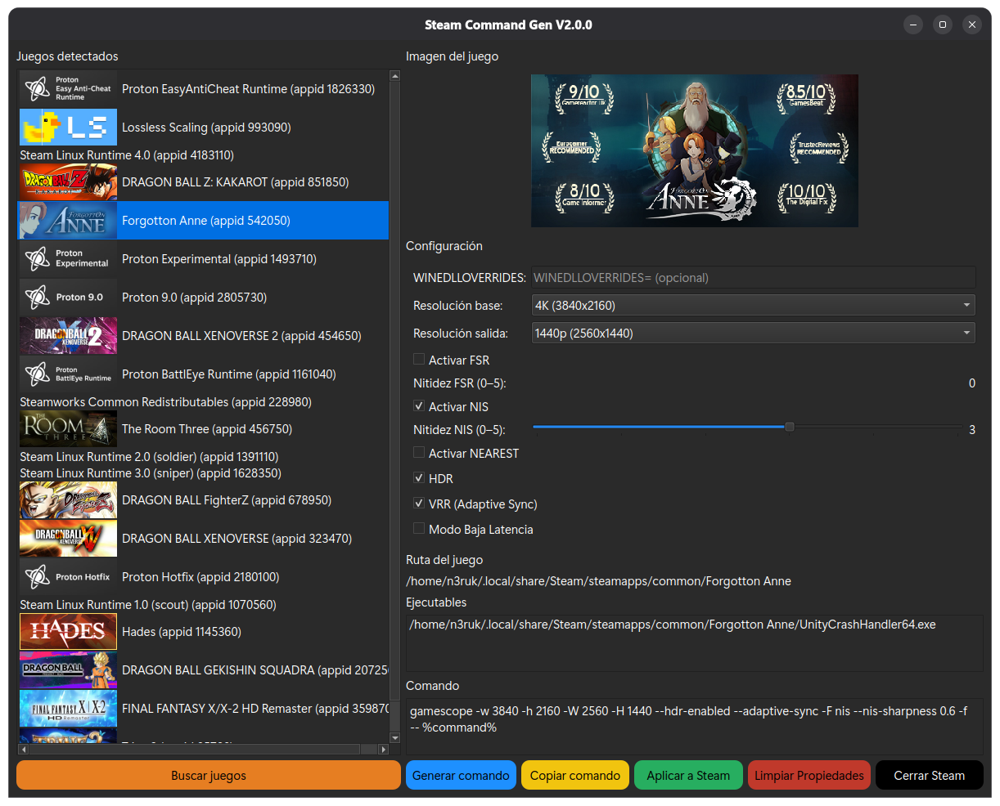

# SteamCommandGen — Gamescope GUI & Steam Launch Options Manager for Linux

**SteamCommandGen** is a graphical **Gamescope configuration tool for Steam on Linux**. It helps you build, apply and manage Steam launch options for **AMD FSR, NVIDIA NIS, HDR, VRR / Adaptive Sync, MangoHud, resolution scaling and low-latency options** without manually writing long Gamescope commands.

> Current version: **SteamCommandGen v3.2.6**
> Español: **[README_ES.md](README_ES.md)**



## What SteamCommandGen does

SteamCommandGen scans your Steam libraries, detects installed games and gives you a visual interface for creating Gamescope launch commands. It can also read existing Steam `LaunchOptions` and restore supported settings back into the interface.

It is useful if you want a **Gamescope GUI for Linux**, a visual **Steam launch options manager**, or an easier way to configure **FSR / NIS upscaling, HDR, VRR and MangoHud** per game.

## Features

- Automatic detection of Steam libraries and installed games.
- Gamescope launch-command generation from a PyQt6 GUI.
- **AMD FidelityFX Super Resolution (FSR)** support.
- **NVIDIA Image Scaling (NIS)** support.
- **Nearest-neighbor scaling** support.
- FSR and NIS sharpness controls.
- Input/output resolutions from **450p to 4K**.
- **HDR** support.
- **VRR / Adaptive Sync** support.
- **Immediate Flips / low-latency** option.
- **MangoHud / MangoApp** integration.
- Built-in `MangoHud.conf` editor and preview.
- `WINEDLLOVERRIDES` support.
- Existing Steam `LaunchOptions` parsing and restoration.
- Clipboard support for generated commands.
- Game artwork loading.
- Filtering of Proton, Steam Linux Runtime, Steamworks redistributables and other non-game tools.
- Available as **AppImage**, **Debian package (`.deb`)** and installer script.

## Gamescope scaling: FSR, NIS and Nearest

SteamCommandGen exposes Gamescope's supported scaling filters directly in the GUI.

| Scaling mode | Gamescope option | Use case |
| --- | --- | --- |
| **AMD FSR** | `-F fsr` | Spatial upscaling with configurable sharpening |
| **NVIDIA NIS** | `-F nis` | NVIDIA Image Scaling with configurable sharpening |
| **Nearest** | `-F nearest` | Nearest-neighbor scaling |

### FSR example

```text
gamescope -w 1920 -h 1080 -W 2560 -H 1440 -F fsr --sharpness 0 -f -- %command%
```

### NIS + MangoHud example

```text
gamescope -w 1920 -h 1080 -W 2560 -H 1440 -F nis --sharpness 0 --mangoapp -f -- %command%
```

### HDR + VRR example

```text
gamescope -w 1920 -h 1080 -W 2560 -H 1440 --hdr-enabled --adaptive-sync -f -- %command%
```

SteamCommandGen presents FSR/NIS sharpening on a simple **0–5 scale** and converts it to the value expected by Gamescope.

## MangoHud integration

SteamCommandGen can enable MangoHud through Gamescope using:

```text
--mangoapp
```

It also includes a graphical editor for:

- FPS and frametime.
- CPU/GPU load and temperatures.
- RAM and VRAM.
- Frequencies and power usage.
- Display resolution and refresh rate.
- HDR / FSR / GameMode status.
- HUD position and layout.
- Colors.
- Toggle hotkey.

The configuration is stored in:

```text
~/.config/MangoHud/MangoHud.conf
```

The editor can create a backup, restore changes on cancel and show a preview when a compatible Vulkan application is available.

## Supported resolutions

- **450p** — 800×450
- **576p** — 1024×576
- **720p** — 1280×720
- **900p** — 1600×900
- **1080p** — 1920×1080
- **1440p** — 2560×1440
- **4K** — 3840×2160

Input and output resolution selectors start empty so SteamCommandGen does not generate an unintended resolution until you choose one.

## Steam LaunchOptions management

When you select a game, SteamCommandGen can parse existing `LaunchOptions` and restore supported values such as:

- Input/output resolution.
- FSR.
- NIS.
- Nearest scaling.
- Sharpness.
- HDR.
- VRR / Adaptive Sync.
- Immediate Flips.
- MangoHud.
- `WINEDLLOVERRIDES`.

The UI resets before loading another game so settings are not mixed between titles.

## Installation

Download the latest build from **[GitHub Releases](../../releases)**.

### Debian / Ubuntu package

```bash
sudo apt install ./SteamCommandGen_3.2.6_amd64.deb
```

### Installer script

```bash
cd src
./install.sh  # as your regular user, without sudo
```

### AppImage

```bash
chmod +x SteamCommandGen-3.2.6-x86_64.AppImage
./SteamCommandGen-3.2.6-x86_64.AppImage
```

On SteamOS, use the AppImage or the user installer. The installer creates its own Python environment and needs an internet connection on the first run. Do not run it with `sudo`.

### Building packages

On Debian/Ubuntu x86_64, run `./packaging/build-deb.sh`. To build the AppImage, install Python 3.14, download the [official appimagetool](https://github.com/AppImage/appimagetool/releases), then run `APPIMAGETOOL=/path/to/appimagetool ./packaging/build-appimage.sh`. Both scripts write to `dist/` by default and accept an output directory as their first argument. The AppImage builder needs Python 3.14 with `venv`, `pip` and internet access. The Debian package uses `python3-pyqt6` from the target distribution.

## Requirements

Main requirements:

- Linux.
- Steam.
- Gamescope.

Running from source also requires:

- Python 3.
- PyQt6.
- Python `vdf` module.

Optional:

- MangoHud for MangoHud/MangoApp features.

## Who is this for?

SteamCommandGen is aimed at Linux gamers who use **Steam + Gamescope** and want a graphical alternative to manually maintaining launch-option strings. It is especially useful when experimenting with different render/output resolutions, **FSR vs NIS**, HDR, VRR or MangoHud across multiple games.

## Changelog

See **[CHANGELOG.md](CHANGELOG.md)** for version history.

## Releases

Official downloads are available under **[Releases](../../releases)**.

## License

See **[LICENSE](LICENSE)** for licensing terms.

## Related projects

- [Gamescope](https://github.com/ValveSoftware/gamescope)
- [MangoHud](https://github.com/flightlessmango/MangoHud)
